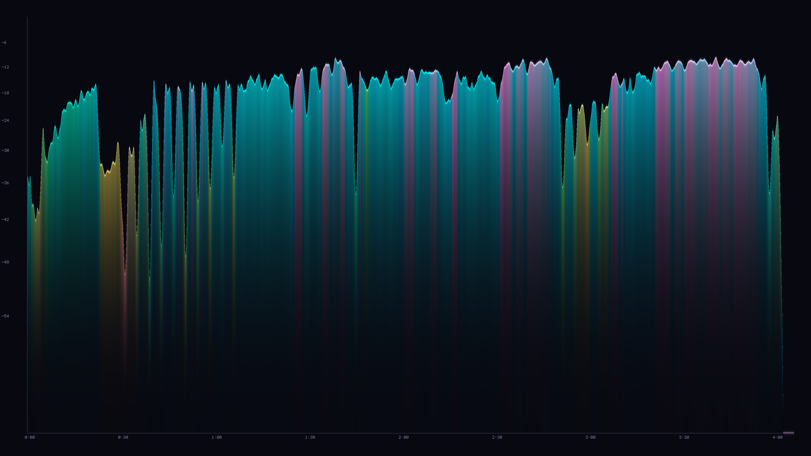
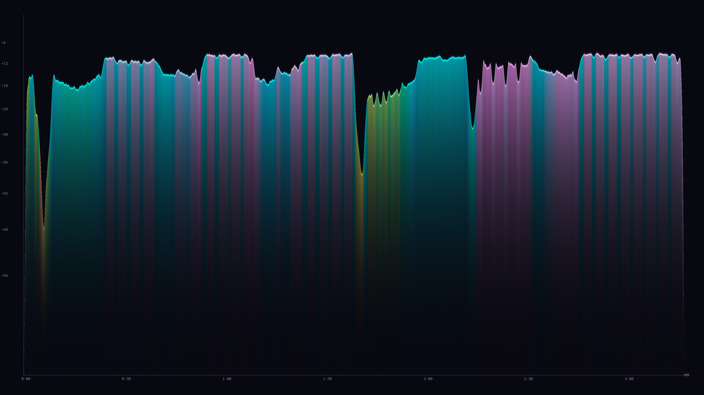

# SpectroVis

Publication-grade audio spectrogram visualizer with perceptually accurate loudness, spectral feature extraction, and CIELAB color mapping.

## Example Output

<p align="center">
  
  
</p>
<p align="center">
  <em>Left: <a href="https://www.youtube.com/watch?v=aatr_2MstrI">Symphony</a> · Right: <a href="https://www.youtube.com/watch?v=9vMh9f41pqE">Tremor</a></em>
</p>

### Color Guide

| Color | Hue (°) | Spectral Centroid | Character |
|-------|---------|-------------------|-----------|
| 🔴 Red | 0° | Very low | Sub-bass / kick drum |
| 🟡 Yellow | ~90° | Low-mid | Bass guitar / low synth |
| 🟢 Green | ~120° | Mid | Vocals / lead instruments |
| 🔵 Cyan | ~180° | High-mid | Pads / strings |
| 🔵 Blue | ~240° | High | Cymbals / air |
| 🟣 Magenta | ~330° | Very high | Brilliance / harmonics |

> **Height** = loudness (LUFS) · **Brightness** = perceptual energy · **Saturation** = spectral spread

---

## Build

```bash
sudo apt install libsndfile1-dev libfftw3-dev libpng-dev cmake g++ pkg-config
mkdir build && cd build
cmake ..
make
```

## Usage

```bash
./spectrovis input.ogg output.png
./spectrovis input.wav
./spectrovis input.flac result.png
```

Supported formats: WAV, OGG, FLAC, AIFF (via libsndfile).

---

## Methodology

### 1. Signal Preprocessing

Input audio is read via `libsndfile` and downmixed to mono by equal-weight channel averaging:

$$x[n] = \frac{1}{C} \sum_{c=1}^{C} x_c[n]$$

where $C$ is the number of channels.

### 2. K-Weighting (ITU-R BS.1770-4)

Two cascaded biquad IIR filters model the frequency response of the human head and ear canal:

**Stage 1 — High-shelf pre-emphasis:**

Transfer function coefficients from BS.1770-4, Table 1:

$$f_0 = 1681.97 \text{ Hz}, \quad G = 3.9998 \text{ dB}, \quad Q = 0.7072$$

**Stage 2 — High-pass (RLB weighting):**

$$f_0 = 38.14 \text{ Hz}, \quad Q = 0.5003$$

Both stages are implemented as Direct Form I biquad filters:

$$y[n] = b_0 x[n] + b_1 x[n{-}1] + b_2 x[n{-}2] - a_1 y[n{-}1] - a_2 y[n{-}2]$$

### 3. Gated Integrated Loudness (BS.1770-4)

Loudness is computed in three passes:

**Block mean-square power** over 400 ms blocks with 75% overlap:

$$z_j = \frac{1}{T} \sum_{n \in \text{block}_j} y_K^2[n]$$

where $y_K[n]$ is the K-weighted signal and $T$ is the block length in samples.

**Absolute gate** at $\Gamma_a = -70$ LUFS removes silence:

$$J_a = \{ j : L_j > \Gamma_a \}$$

**Relative gate** at integrated loudness of $J_a$ minus 10 LU:

$$\Gamma_r = \left( -0.691 + 10 \log_{10} \frac{1}{|J_a|} \sum_{j \in J_a} z_j \right) - 10$$

**Integrated loudness:**

$$L_K = -0.691 + 10 \log_{10} \left( \frac{1}{|J_r|} \sum_{j \in J_r} z_j \right)$$

where $J_r = \{ j : L_j > \Gamma_a \text{ and } L_j > \Gamma_r \}$.

### 4. Short-Time Fourier Transform

Centered framing with symmetric boundary extension and Hann window:

$$w[n] = \frac{1}{2}\left(1 - \cos\frac{2\pi n}{N-1}\right), \quad n = 0, \ldots, N{-}1$$

**Window energy normalization** corrects for the energy reduction introduced by windowing:

$$E_{\text{norm}} = \frac{N}{\sum_{n=0}^{N-1} w^2[n]}$$

| Parameter | Value |
|-----------|-------|
| Window length $N$ | 1024 samples |
| Window type | Hann |
| Zero-padding factor | 4× |
| FFT size $N_{\text{FFT}}$ | 4096 |
| Hop size | 512 samples (50% overlap) |
| Frequency resolution | $f_s / N_{\text{FFT}}$ |

The normalized power spectrum:

$$P[k] = \frac{E_{\text{norm}}}{N_{\text{FFT}}^2} \left( \text{Re}(X[k])^2 + \text{Im}(X[k])^2 \right)$$

**Parseval consistency** is maintained:

$$\sum_{n=0}^{N-1} x^2[n] = \frac{1}{N} \sum_{k=0}^{N-1} |X[k]|^2$$

### 5. Mel Filterbank (Slaney Style)

The Slaney Mel scale is piecewise linear below 1000 Hz and logarithmic above:

$$m = \begin{cases} \frac{3f}{200} & f < 1000 \text{ Hz} \\ 15 + \frac{27 \log_{10}(f/1000)}{\log_{10} 6.4} & f \geq 1000 \text{ Hz} \end{cases}$$

Triangular filters are constructed using **fractional bin indices** (no integer rounding at filter edges) and **area-normalized** for energy conservation:

$$\hat{H}_m[k] = \frac{H_m[k]}{\sum_{k'} H_m[k']}$$

| Parameter | Value |
|-----------|-------|
| Number of bands | 128 |
| Frequency range | 20 Hz – 16000 Hz |
| Scale | Slaney (Auditory Toolbox) |
| Normalization | Area (energy-preserving) |

### 6. Spectral Feature Extraction

All features are computed in the log-Mel domain for perceptual accuracy.

**Mel-domain spectral centroid:**

$$\mu_c = \frac{\sum_{m=0}^{M-1} m \cdot S'[m]}{\sum_{m=0}^{M-1} S'[m]}$$

where $S'[m] = \max(0, \, 10\log_{10} S[m] + 80)$ shifts log-Mel values to positive range.

**Spectral spread (standard deviation):**

$$\sigma = \sqrt{\frac{\sum_{m=0}^{M-1} S'[m] \cdot (m - \mu_c)^2}{\sum_{m=0}^{M-1} S'[m]}}$$

**Spectral flux (half-wave rectified L2 norm):**

$$\Phi_t = \sqrt{\frac{1}{M} \sum_{m=0}^{M-1} H\!\left(S'_t[m] - S'_{t-1}[m]\right)^2}$$

where $H(x) = \max(0, x)$ is the half-wave rectifier.

**Spectral rolloff** at 85%:

$$f_r = \min\left\lbrace k : \sum_{b=0}^{k} P[b] \geq 0.85 \sum_{b=0}^{N/2} P[b] \right\rbrace \cdot \Delta f$$

**Spectral flatness (Wiener entropy):**

$$\text{SF} = \frac{\exp\!\left(\frac{1}{K}\sum_{k=1}^{K} \ln P[k]\right)}{\frac{1}{K}\sum_{k=1}^{K} P[k]}$$

### 7. Savitzky–Golay Smoothing

The filter coefficients are computed via the exact least-squares solution. Given a Vandermonde matrix $\mathbf{J}$ of polynomial order $p$ over window $[-M, M]$:

$$\mathbf{c} = \mathbf{e}_0^\top (\mathbf{J}^\top \mathbf{J})^{-1} \mathbf{J}^\top$$

where $\mathbf{e}_0$ is the first standard basis vector (smoothing, not differentiation).

| Parameter | Loudness curve | Spectral features |
|-----------|---------------|-------------------|
| Half-window $M$ | 15 | 20 |
| Polynomial order | 3 (cubic) | 3 (cubic) |
| Boundary | Symmetric extension | Symmetric extension |
| Passes | 2 (cascade) | 1 |

### 8. Perceptual Normalization

**Loudness:** Linear mapping from $[\text{floor}, \text{ceil}]$ LUFS range, followed by gamma correction approximating Stevens' power law for loudness perception:

$$v' = v^{0.55}$$

**Spectral features:** Percentile compression (98th/95th percentile as reference) prevents outlier domination.

### 9. CIELAB Color Mapping

Spectral features map to CIELAB coordinates for **perceptual uniformity**:

| Feature | CIELAB Dimension | Mapping |
|---------|-----------------|---------|
| Mel centroid | Hue angle $h$ in $a^{\ast}b^{\ast}$ plane | $h = \mu_c \cdot 330°$ |
| Spectral spread | Chroma $C^{\ast} = \sqrt{a^{\ast 2} + b^{\ast 2}}$ | $C^{\ast} = 25 + \sigma \cdot 70$ |
| Loudness (LUFS) | Lightness $L^{\ast}$ | $L^{\ast} = 25 + v' \cdot 70$ |

$$a^{\ast} = C^{\ast} \cos(h), \quad b^{\ast} = C^{\ast} \sin(h)$$

**CIELAB to sRGB conversion:**

$$L^{\ast}, a^{\ast}, b^{\ast} \xrightarrow{\text{inverse}} X, Y, Z \xrightarrow{D65} R_{\text{lin}}, G_{\text{lin}}, B_{\text{lin}} \xrightarrow{\gamma_{2.4}} R, G, B$$

**Soft gamut compression** replaces hard clamping for out-of-gamut colors, preserving hue relationships:

$$f(x) = \begin{cases} x & 0 \leq x \leq 1 \\ 1 - \frac{1}{1 + (x-1)} & x > 1 \end{cases}$$

### 10. Rendering Pipeline

1. Gradient fill below curve with quadratic alpha falloff: $\alpha = 0.6(1-t)^{2.5} + 0.01$
2. Wide Gaussian glow (±16 px): $\alpha = 0.38 \cdot e^{-4d^2}$
3. Core line (±3 px) with linear taper
4. Grid lines at standard dB intervals and time ticks
5. Axis labels rendered via embedded 5×7 bitmap font

---

## Output Specification

| Property | Value |
|----------|-------|
| Resolution | 3840 × 2160 (4K UHD) |
| Color depth | 24-bit sRGB |
| Format | PNG (lossless) |
| X-axis | Time (mm:ss) |
| Y-axis | Loudness (LUFS, dB scale) |
| Color hue | Mel-domain spectral centroid |
| Color saturation | Spectral spread |
| Color brightness | Perceptual loudness |

## License

MIT
